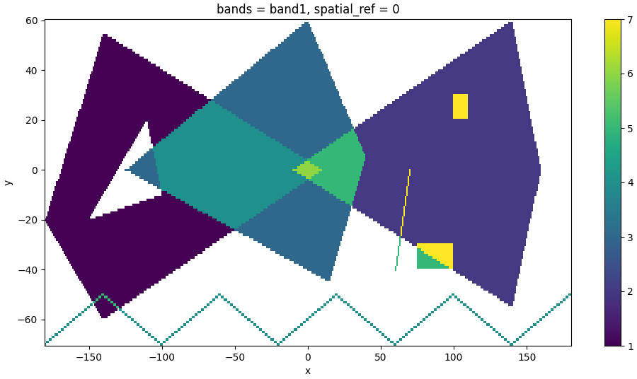

# rusterize

High performance rasterization tool for Python built in Rust. This repository is inspired by the [fasterize](https://github.com/ecohealthalliance/fasterize.git) package and ports parts of the logics into Python with a Rust backend, in addition to useful improvements (see [API](#API)).

**rusterize** is designed to work on _all_ shapely geometries, even when they are nested inside complex geometry collections. Functionally, it takes an input [geopandas](https://geopandas.org/en/stable/) dataframe and returns a [xarray](https://docs.xarray.dev/en/stable/), a [numpy](https://numpy.org/), or a sparse array in COOrdinate format.

# Installation

`rusterize` is distributed in two flavors. A `core` library that performs the rasterization and returns a bare `numpy` array, or a `xarray` version that returns a georeferenced `xarray`. This latter requires `xarray` and `rioxarray` to be installed. This is the recommended flavor.

Install the current version with pip:

```shell
# Core library
pip install rusterize

# With xarray capabilities
pip install 'rusterize[xarray]'
```

# Contributing

Any contribution is welcome! You can install **rusterize** directly from this repo using [maturin](https://www.maturin.rs/) as an editable package. For this to work, you’ll need to have [Rust](https://www.rust-lang.org/tools/install) and [cargo](https://doc.rust-lang.org/cargo/getting-started/installation.html)
installed.

```shell
# Clone repo
git clone https://github.com/<username>/rusterize.git
cd rusterize

# Install the Rust nightly toolchain
rustup toolchain install nightly-2026-01-09

 # Install maturin
pip install maturin

# Install editable version with optmized code
maturin develop --profile dist-release
```

# API

**rusterize** has a simple API consisting of a single function `rusterize()`:

```python
from rusterize import rusterize

# gdf = <geodataframe>

rusterize(
    gdf,
    like=None,
    res=(30, 30),
    out_shape=(10, 10),
    extent=(0, 10, 10, 20),
    field="field",
    by="by",
    burn=None,
    fun="sum",
    background=0,
    encoding="xarray",
    all_touched=False,
    tap=False,
    dtype="uint8"
)
```

- `gdf`: geopandas dataframe to rasterize
- `like`: xr.DataArray to use as template for `res`, `out_shape`, and `extent`. Mutually exclusive with these parameters (default: `None`)
- `res`: (xres, yres) for desired resolution (default: `None`)
- `out_shape`: (ncols, nrows) for desired output shape (default: `None`)
- `extent`: (xmin, ymin, xmax, ymax) for desired output extent (default: `None`)
- `field`: column to rasterize. Mutually exclusive with `burn` (default: `None` -> a value of `1` is rasterized)
- `by`: column for grouping. Assign each group to a band in the stack. Values are taken from `field` if specified, else `burn` is rasterized (default: `None` -> singleband raster)
- `burn`: a single value to burn. Mutually exclusive with `field` (default: `None`). If no field is found in `gdf` or if `field` is `None`, then `burn=1`
- `fun`: pixel function to use when multiple values overlap. Available options are `sum`, `first`, `last`, `min`, `max`, `count`, or `any` (default: `last`)
- `background`: background value in final raster (default: `np.nan`). A `None` value corresponds to the default of the specified dtype. An illegal value for a dtype will be replaced with the default of that dtype. For example, a `background=np.nan` for `dtype="uint8"` will become `background=0`, where `0` is the default for `uint8`.
- `encoding`: defines the output format of the rasterization. This is either a dense xarray/numpy representing the burned rasterized geometries, or a sparse array in COOrdinate format good for sparse observations and low memory consumption. Available options are `xarray`, `numpy`, `sparse` (default: `xarray` -> will trigger an error if `xarray` and `rioxarray` are not found).
- `all_touched`: whether every pixel touching the geometry should be burned.
- `tap`: target aligned pixel to align the extent to the pixel resolution (defaul: `False`).
- `dtype`: dtype of the final raster. Available options are `uint8`, `uint16`, `uint32`, `uint64`, `int8`, `int16`, `int32`, `int64`, `float32`, `float64` (default: `float64`)

Note that control over the desired extent is not as strict as for resolution and shape. That is, when resolution, output shape, and extent are specified, priority is given to resolution and shape. So, extent is not guaranteed, but resolution and shape are. If extent is not given, it is taken from the polygons and is not modified, unless you specify a resolution value. If you only specify an output shape, the extent is maintained. This mimics the logics of `gdal_rasterize`.

# Encoding

Version 0.5.0 introduced a new `encoding` parameter to control the output format of the rasterization. This means that you can return a `xarray/numpy` with the rasterized geometries, or a new `SparseArray` structure. This `SparseArray` structure stores the band/row/column triplets of where the geometries should be burned onto the final raster, as well as their corresponding values before applying any pixel function. This can be used as an intermediate output to avoid allocating memory before materializing the final raster, or as a final product. `SparseArray` has three convenience functions: `to_xarray()`, `to_numpy()`, and `to_frame()`. The first two return the final `xarray/numpy` with the appropriate pixel function, the last returns a `polars` dataframe with only the coordinates and values of the rasterized geometries. Note that `SparseArray` avoids allocating memory for the array during rasterization until it's actually needed (e.g. calling `to_xarray()`). See below for an example.

# Usage

```python
from rusterize import rusterize
import geopandas as gpd
from shapely import wkt
import matplotlib.pyplot as plt

# construct geometries
geoms = [
    "POLYGON ((-180 -20, -140 55, 10 0, -140 -60, -180 -20), (-150 -20, -100 -10, -110 20, -150 -20))",
    "POLYGON ((-10 0, 140 60, 160 0, 140 -55, -10 0))",
    "POLYGON ((-125 0, 0 60, 40 5, 15 -45, -125 0))",
    "MULTILINESTRING ((-180 -70, -140 -50), (-140 -50, -100 -70), (-100 -70, -60 -50), (-60 -50, -20 -70), (-20 -70, 20 -50), (20 -50, 60 -70), (60 -70, 100 -50), (100 -50, 140 -70), (140 -70, 180 -50))",
    "GEOMETRYCOLLECTION (POINT (50 -40), POLYGON ((75 -40, 75 -30, 100 -30, 100 -40, 75 -40)), LINESTRING (60 -40, 80 0), GEOMETRYCOLLECTION (POLYGON ((100 20, 100 30, 110 30, 110 20, 100 20))))"
]

# convert WKT strings to Shapely geometries
geometries = [wkt.loads(geom) for geom in geoms]

# create a GeoDataFrame
gdf = gpd.GeoDataFrame({'value': range(1, len(geoms) + 1)}, geometry=geometries, crs='EPSG:32619')

# rusterize to "xarray" -> return a xarray with the burned geometries and spatial reference (default)
# will raise a ModuleNotFoundError if xarray and rioxarray are not found
output = rusterize(
    gdf,
    res=(1, 1),
    field="value",
    fun="sum",
).squeeze()

# plot it
fig, ax = plt.subplots(figsize=(12, 6))
output.plot.imshow(ax=ax)
plt.show()

# rusterize to "sparse" -> custom structure storing the coordinates and values of the rasterized geometries
output = rusterize(
    gdf,
    res=(1, 1),
    field="value",
    fun="sum",
    encoding="sparse"
)
output
# SparseArray:
# - Shape: (131, 361)
# - Extent: (-180.5, -70.5, 180.5, 60.5)
# - Resolution: (1.0, 1.0)
# - EPSG: 32619
# - Estimated size: 378.33 KB

# materialize into xarray or numpy
array = output.to_xarray()
array = output.to_numpy()

# get only coordinates and values
output.to_frame()
# shape: (29_340, 3)
# ┌─────┬─────┬──────┐
# │ row ┆ col ┆ data │
# │ --- ┆ --- ┆ ---  │
# │ u32 ┆ u32 ┆ f64  │
# ╞═════╪═════╪══════╡
# │ 6   ┆ 40  ┆ 1.0  │
# │ 6   ┆ 41  ┆ 1.0  │
# │ 6   ┆ 42  ┆ 1.0  │
# │ 7   ┆ 39  ┆ 1.0  │
# │ 7   ┆ 40  ┆ 1.0  │
# │ …   ┆ …   ┆ …    │
# │ 64  ┆ 258 ┆ 1.0  │
# │ 63  ┆ 259 ┆ 1.0  │
# │ 62  ┆ 259 ┆ 1.0  │
# │ 61  ┆ 260 ┆ 1.0  │
# │ 60  ┆ 260 ┆ 1.0  │
# └─────┴─────┴──────┘
```



# Benchmarks

**rusterize** is fast! Let’s try it on small and large datasets in comparison to GDAL ([benchmark_rusterize.py](benchmarks/benchmark_rusterize.py)).

You can run it with [pytest](https://docs.pytest.org/en/stable/) and [pytest-benchmark](https://pytest-benchmark.readthedocs.io/en/stable/):

```
pytest <python file> --benchmark-min-rounds=10 --benchmark-time-unit='s'

------------------------------------------------------------------- benchmark: 7 tests ------------------------------------------------------------
Name                                 Min         Max       Mean     StdDev      Median        IQR    Outliers           OPS    Rounds    Iterations
---------------------------------------------------------------------------------------------------------------------------------------------------
test_water_small_f64_numpy        0.0044      0.0221     0.0090     0.0047      0.0064     0.0070        32;0      111.4936       156             1
test_water_small_f64              0.0054      0.0309     0.0084     0.0039      0.0068     0.0026       14;14      118.7794       149             1
test_water_large_f64_numpy        1.5214      2.1011     1.8225     0.1610      1.8015     0.1500         3;1        0.5487        10             1
test_water_large_f64              1.6683      2.2734     1.9249     0.2019      1.9257     0.2782         4;0        0.5195        10             1
test_water_large_gdal_vsimem_f64  2.4127      2.4414     2.4217     0.0085      2.4203     0.0092         2;1        0.4129        10             1
test_roads_uint8                  3.5505     17.1630     6.5959     5.1604      3.6147     5.9051         2;0        0.1516        10             1
test_roads_gdal_vsimem_uint8      9.6371     11.0570    10.3093     0.6694     10.2655     1.3462         4;0        0.0970        10             1
---------------------------------------------------------------------------------------------------------------------------------------------------

```

And fasterize ([benchmark_fasterize.r](benchmarks/benchmark_fasterize.r)). Note that it doesn't support custom `dtype` so the returning raster is `float64`.

```
Unit: seconds
            expr              min           lq        mean       median          uq         max neval
 fasterize_small_f64   0.05764281   0.06274373   0.1286875   0.06520358   0.1128432   0.6000182    10
 fasterize_large_f64  36.91321005  37.71877265  41.0140303  40.81343803  43.9201820  46.5596799    10
```

# Comparison with other tools

While **rusterize** is fast, there are other fast alternatives out there, including `rasterio` and `geocube`. However, **rusterize** allows for a seamless, Rust-native processing with similar or lower memory footprint that doesn't require you to install GDAL and returns the geoinformation you need for downstream processing with ample control over resolution, shape, extent, and data type.

The following is a time comparison of 10 runs (median) on the same large water bodies dataset used earlier (dtype is `float64`) ([run_others.py](benchmarks/run_others.py)).

```
rusterize: 2.1 sec
rasterio:  15.2 sec
geocube:   129.2 sec
```

# Integrations

**rusterize** is integrated into the following libraries:

- [rasterix](https://github.com/xarray-contrib/rasterix)
