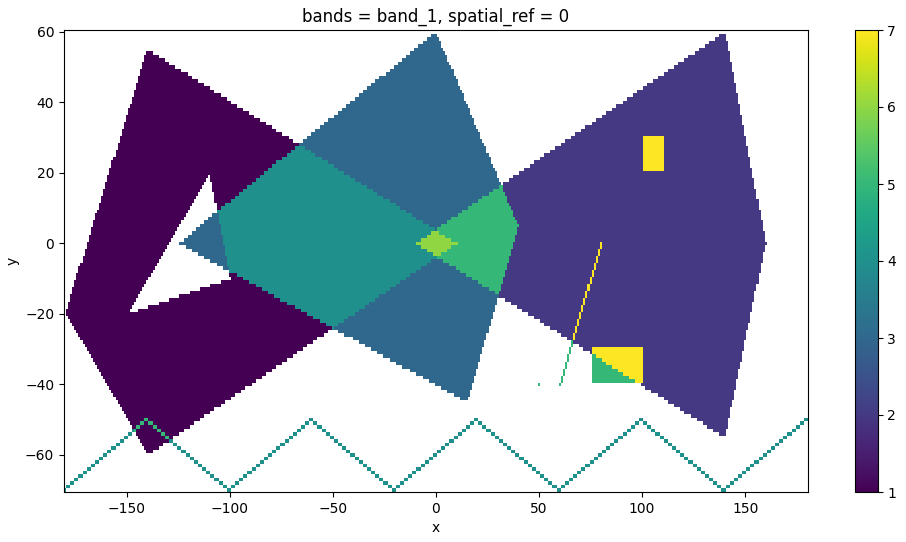

# rusterize in Python

**rusterize** is designed to work on _all_ shapely geometries, even when they are nested inside complex geometry collections. Functionally, it supports four input types:

- [geopandas](https://geopandas.org/en/stable/) GeoDataFrame and GeoSeries
- [polars-st](https://oreilles.github.io/polars-st/) GeoDataFrame
- Python list of geometries in shapely.Geometry, WKB, or WKT format
- Numpy array of geometries in shapely.Geometry, WKB, or WKT format

It returns a [xarray](https://docs.xarray.dev/en/stable/), a [numpy](https://numpy.org/), or a custom sparse array in COOrdinate format.

## Installation

**rusterize** comes with `numpy` as the only required dependency and is distributed in different flavors. A `core` library that performs the rasterization and returns
a bare `numpy` array, a `xarray` flavor that returns a georeferenced `xarray` (requires `xarray` and `rioxarray` and is the recommended flavor), or an `all` flavor with
dependencies for all supported inputs.

Install the current version with pip:

```bash
# core library
pip install rusterize

# xarray capabilities
pip install 'rusterize[xarray]'

# support all input types
pip install 'rusterize[all]'
```

## Usage

Visit the full [API reference](api.md).

```python
from rusterize import rusterize
import geopandas as gpd
from shapely import wkt
import matplotlib.pyplot as plt

# construct geometries
geoms = [
    "POLYGON ((-180 -20, -140 55, 10 0, -140 -60, -180 -20), (-150 -20, -100 -10, -110 20, -150 -20))",
    "POLYGON ((-10 0, 140 60, 160 0, 140 -55, -10 0))",
    "POLYGON ((-125 0, 0 60, 40 5, 15 -45, -125 0))",
    "MULTILINESTRING ((-180 -70, -140 -50), (-140 -50, -100 -70), (-100 -70, -60 -50), (-60 -50, -20 -70), (-20 -70, 20 -50), (20 -50, 60 -70), (60 -70, 100 -50), (100 -50, 140 -70), (140 -70, 180 -50))",
    "GEOMETRYCOLLECTION (POINT (50 -40), POLYGON ((75 -40, 75 -30, 100 -30, 100 -40, 75 -40)), LINESTRING (60 -40, 80 0), GEOMETRYCOLLECTION (POLYGON ((100 20, 100 30, 110 30, 110 20, 100 20))))"
]

# create a GeoDataFrame with shapely geometries from WKT
gdf = gpd.GeoDataFrame({'value': range(1, len(geoms) + 1)}, geometry=wkt.loads(geoms), crs='EPSG:32619')

output = rusterize(
    gdf,
    res=(1, 1),
    field="value",
    fun="sum",
).squeeze()

# plot it
fig, ax = plt.subplots(figsize=(12, 6))
output.plot.imshow(ax=ax)
plt.show()
```



You could also create a multiband output by specifing the `by` parameter.

```python
gdf["by"] = ["a", "a", "b", "b", "c"]

output = rusterize(
    gdf,
    res=(1, 1),
    field="value",
    by="by",
    fun="sum",
)
```

Alternatively, you can pass raw values to burn on the final raster, one per geometry.

```python
import numpy as np

output = rusterize(
    geoms,
    res=(1, 1),
    fun="sum",
    burn=np.arange(1, len(geoms) + 1)
).squeeze()
```

Finally, you can also create a [`SparseArray`](api.md#sparsearray), that is an object storing the band/row/col value triplets of all pixels that will be materialized in a final raster.

```python
output = rusterize(
    gdf,
    res=(1, 1),
    field="value",
    fun="sum",
    encoding="sparse"
)
output
# SparseArray:
# - Shape: (131, 361)
# - Extent: (-180.5, -70.5, 180.5, 60.5)
# - Resolution: (1.0, 1.0)
# - EPSG: 32619
# - Estimated size: 378.33 KB

# materialize into xarray or numpy
array = output.to_xarray()
array = output.to_numpy()

# get only coordinates and values
output.to_frame()
# shape: (29_363, 3)
# ┌─────┬─────┬────────┐
# │ row ┆ col ┆ values │
# │ --- ┆ --- ┆ ---    │
# │ u64 ┆ u64 ┆ f64    │
# ╞═════╪═════╪════════╡
# │ 6   ┆ 40  ┆ 1.0    │
# │ 6   ┆ 41  ┆ 1.0    │
# │ 6   ┆ 42  ┆ 1.0    │
# │ 7   ┆ 39  ┆ 1.0    │
# │ 7   ┆ 40  ┆ 1.0    │
# │ …   ┆ …   ┆ …      │
# │ 39  ┆ 286 ┆ 5.0    │
# │ 39  ┆ 287 ┆ 5.0    │
# │ 39  ┆ 288 ┆ 5.0    │
# │ 39  ┆ 289 ┆ 5.0    │
# │ 39  ┆ 290 ┆ 5.0    │
# └─────┴─────┴────────┘
```

## Benchmarks

**rusterize** is fast! Let’s try it on small and large datasets in comparison to GDAL ([benchmark_rusterize.py](https://github.com/ttrotto/rusterize/blob/c3f60249e213753e45e721fb25ebe6519050a884/python/benchmarks/benchmark_rusterize.py)).
You can run this with [pytest](https://docs.pytest.org/en/stable/) and [pytest-benchmark](https://pytest-benchmark.readthedocs.io/en/stable/):

```
pytest <python file> --benchmark-min-rounds=10 --benchmark-time-unit='s'

--------------------------------------------- benchmark: 8 tests -------------------------------------------------
Name (time in s)               Min     Max    Mean  StdDev  Median     IQR  Outliers       OPS  Rounds  Iterations
------------------------------------------------------------------------------------------------------------------
test_water_small_f64_numpy  0.0038  0.0045  0.0040  0.0001  0.0040  0.0002      56;3  248.7981     181           1
test_water_small_f64        0.0048  0.0057  0.0050  0.0001  0.0050  0.0001      21;9  198.8759     158           1
test_water_small_gdal_f64   0.0053  0.0057  0.0054  0.0001  0.0054  0.0001     28;14  184.3595     160           1
test_water_large_f64_numpy  1.2628  1.3610  1.3133  0.0314  1.3193  0.0498       5;0    0.7614      10           1
test_water_large_f64        1.2762  1.4723  1.3342  0.0628  1.3149  0.0165       2;4    0.7495      10           1
test_water_large_gdal_f64   1.4128  1.4229  1.4178  0.0029  1.4180  0.0040       3;0    0.7053      10           1
test_roads_uint8            3.3184  3.5184  3.4021  0.0578  3.3849  0.0527       3;1    0.2939      10           1
test_roads_gdal_uint8       9.0672  9.1040  9.0901  0.0109  9.0920  0.0125       2;0    0.1100      10           1
------------------------------------------------------------------------------------------------------------------
```

### Comparison with other tools

While **rusterize** is fast, there are other fast alternatives out there, including `rasterio` and `geocube`. However, **rusterize** allows for a seamless,
Rust-native processing with similar or lower memory footprint that **does not** require you to install GDAL and returns the geoinformation you need for downstream
processing with ample control over resolution, shape, extent, data type, and encoding.

The following is a time comparison of 10 runs (median) on the same large water bodies dataset used earlier (dtype is `float64`) ([run_others.py](https://github.com/ttrotto/rusterize/blob/c3f60249e213753e45e721fb25ebe6519050a884/python/benchmarks/run_others.py)).

```
rusterize: 1.3 sec
rasterio:  14.5 sec
geocube:   124.9 sec
```
